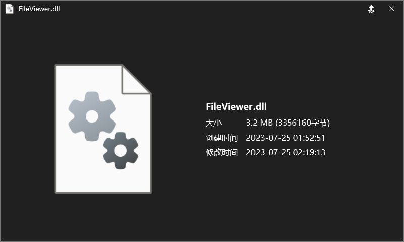
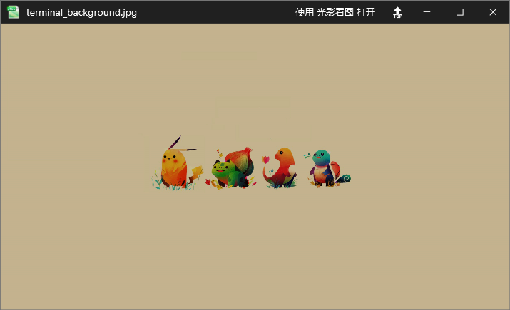
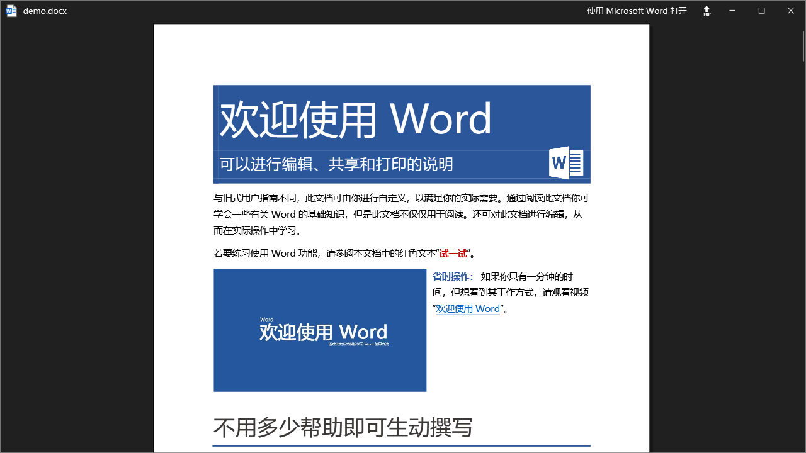
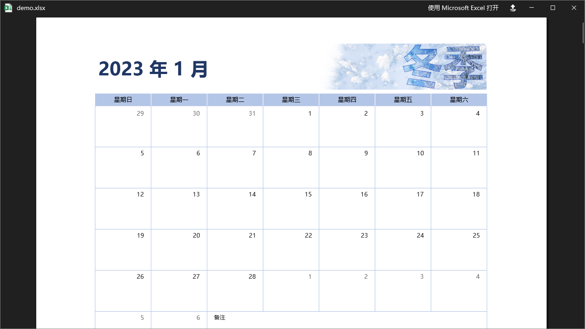
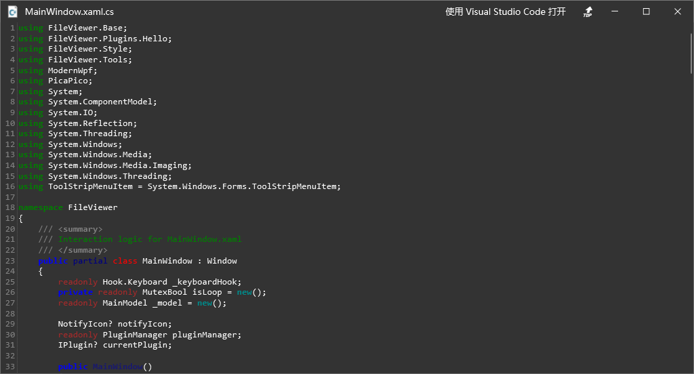

# FileViewer

**A FileViewer Desktop Client for Windows.**

## Usage

### Download/Installation

**Access to the "[Releases](https://github.com/HeHang0/FileViewer/releases)" page and download the FileViewer.zip.**

### Run

-   Run `FileViewer.exe` (only necessary on first run)
-   Select any file or folder on anywhere
-   Press `Space`
-   Enjoy the preview
-   Preview other file just select the file

### Hotkeys

-   `Space` Show/Hide the preview window

## Supported FileTypes

#### General

#### Image

#### Music

#### Movie

#### Pdf

### Word

### Excel

### PowerPoint

### Text / Code

